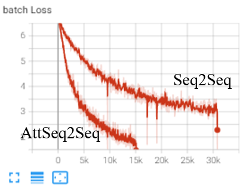
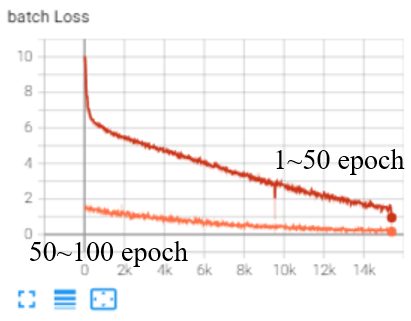
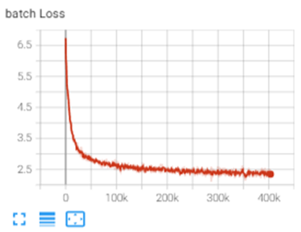
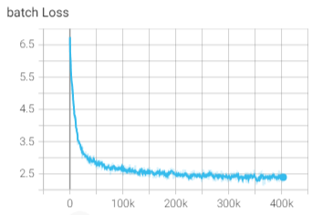

# Easy-Seq2Seq
This repository provides an easy-to-deploy Seq2Seq model for NLP beginners using the latest (2024) PyTorch version. It includes implementations for both traditional Seq2Seq models and more advanced architectures like Transformer and RNN+Attention for English-Chinese translation.

## Getting Started
1. Install Anaconda
Follow the steps below to install dependencies and set up your environment.
2. Create Environment and Install Dependencies 
Create a new Conda environment and install the necessary packages:
```
conda create --name ml python=3.8.19
conda activate ml
pip install torch==2.0.0 torchvision==0.15.1 torchaudio==2.0.1
pip install spacy==3.6.1
python -m spacy download en_core_web_sm
python -m spacy download zh_core_web_sm
```

## Main requirements
- torch==2.0.0
- torchtext==0.15.1
- spacy==3.6.1  

Full list of dependencies is available in `requirements.txt`.

## Dataset
### Download Dataset
Download Google's Chinese-to-English translation dataset from [here](https://www.kaggle.com/datasets/qianhuan/translation/data). Before using it, you need to preprocess it using `fix.py`.
For quick deployment, you can use the fixed smaller dataset `translation2019zh_valid_fixed.json`.

### Download Pretrained Weights
| Model    | ckpt | train fig | Examples                                 |
|----------|------|-----------|------------------------------------------|
| Seq2Seq  | seq2seq_valid_100epoch.pth.tar  |        | Input sentence: '你知道的，我会永远爱着你。'<br>Output sentence: 'I love you love you.' |
| AttSeq2Seq  | seq2seqAtt_valid_50epoch.pth.tar  |        | Input sentence: '你知道的，我会永远爱着你。'<br>Output sentence: 'You know that you will hear the sound of love.' |
| Transformer(valid)  | transformer_valid_100epoch.pth.tar  |        | Input sentence: '你知道的，我会永远爱着你。'<br>Output sentence: 'I know you want to take. I see that.' |
| Transformer Chinese to English (train)  | transformer_train_10epoch.pth.tar<br> The checkpoint is available [here](https://drive.google.com/file/d/17FWZYQHfrbizPT2JZ2Pb8FmpfwcsVjOZ/view?usp=drive_link).  |        | Input sentence: '你知道的，我会永远爱着你。'<br>Output sentence: 'You know, I 'll always love you.'<br>Input sentence: '美国缓慢地开始倾听，但并非没有艰难曲折。'<br>Output sentence: 'The United States slowly began to listen, but not without difficulty.'<br>**Groundingtruth:**'Slowly and not without struggle, America began to listen.'  |
| Transformer English to Chinese (train)  | transformer_train_10epoch_en2zh.pth.tar<br> The checkpoint is available [here](https://drive.google.com/file/d/1aa61o7c0twOP6jSDhu0nXcDWpoCYz_7-/view?usp=drive_link).  |        | Input sentence: `'You know, I'll always love you.'`<br>Output sentence: `'你知道，我永远爱你。'`<br>Input sentence: `'She just gaped at me when I told her the news.'`<br>Output sentence:` '我告诉她这个消息时，她只是<unk>了一下我。'`<br>**Groundingtruth:**`'当我把消息告诉她时，她简直目瞪口呆。'`  |


More results on Transformer (trained on `translation2019zh_train` dataset for 10 epochs): 
```
input sentence = "你们可能不知道只用20万赢到578万是什么概念，我们一般只会用两个字来形容这种人:赌怪！"
output sentence = You may not know what the concept of <unk> <unk> is, we usually use two <unk> to describe this person : <unk>!

input sentence = "全民制作人大家好，我是练习时长两年半的个人练习生蔡徐坤。喜欢唱、跳、rap、篮球。"
output sentence = All the producers are good. I am a two - and - a - half years ' personal <unk>. I like singing, dancing, <unk> and basketball.

input sentence = "电车难题是这样的，被绑在铁轨上的人只顾等死就可以了，控制电车转向的人要考虑的事情就多了。"
output sentence = The problem is that the people who are strapped on the rail can be killed and the people who control the <unk> will think of more.
```


## Train
1. Set configuration parameters in `train.py`:
```
train(num_epochs=50,
        learning_rate = 0.001, # 0.001
        batch_size = 256,
        load_model_ckpt ='', # whether to use ckpt
        save_model_ckpt_name = 'checkpoint_valid_dataset.pth.tar',
        device = 'cuda:0', # your device, if you don't have gpu, use 'cpu'
        model = "Seq2Seq",
        test_sentence = "你知道的，我会永远爱着你。",
        dataset_path = "YOUR_DATASET_PATH/en2cn/translation2019zh_valid_fixed.json",
        vocab_path = "vocab30k_valid",
        run_name = 'Seq2Seq_100epoch_valid',
        epoch_per_eval = 50,
        epoch_per_save = 25,
        )
```
2. Start training by running:
```
python train.py
```

## Inference
After training, you can use the trained model for inference.
1. Set the configuration in `inference.py`:
```
inference(
       english_vocab_path = "vocab30k/english_vocab.pt",
       chinese_vocab_path = "vocab30k/chinese_vocab.pt",
       model_ckpt_path = "checkpoint_valid_dataset.pth.tar",
       device = "cuda:0",
       model = "Seq2Seq",
       sentence_to_translate = '你知道的，我会永远爱着你。',

)
```
2. Run inference with:
```
python inference.py
```

## Project Structure
### Key Files:
- get_loader.py: Defines the data loader using `torchtext`.
- train.py: Script for training the Seq2Seq model.
- model.py: Defines the Seq2Seq model architecture.
- inference.py: Translates Chinese sentences into English using the trained model.


## Acknowledgment
This project is based on the following open-source repositories:

- [Chinese2English-Translation-seq2seq](https://github.com/Mountchicken/Chinese2English-Translation-seq2seq) 
- [pytorch-seq2seq](https://github.com/bentrevett/pytorch-seq2seq/tree/main). 
- [DASOU讲AI](https://www.bilibili.com/video/BV1dR4y1E7aL/?spm_id_from=333.337.search-card.all.click&vd_source=132c74f7a893f6ef64b723d9600c40b7)  

Special thanks to [ChatGPT](https://chatgpt.com/) for generating parts of the code, which saved considerable time during development.

